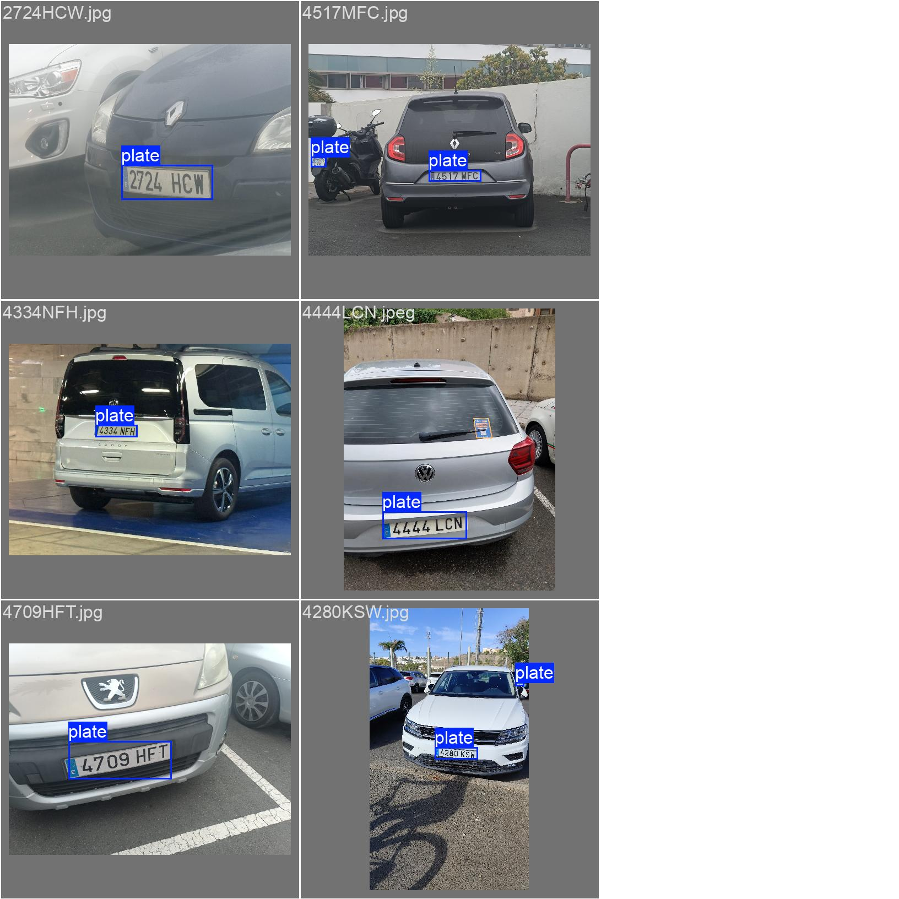
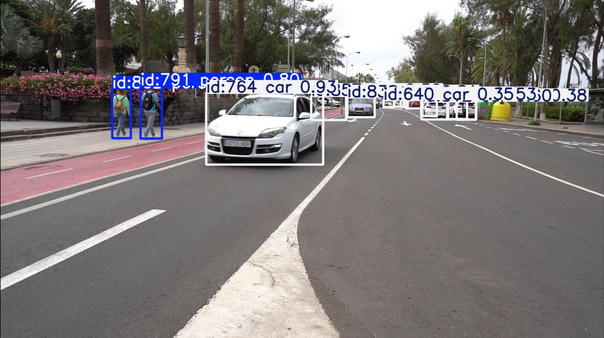
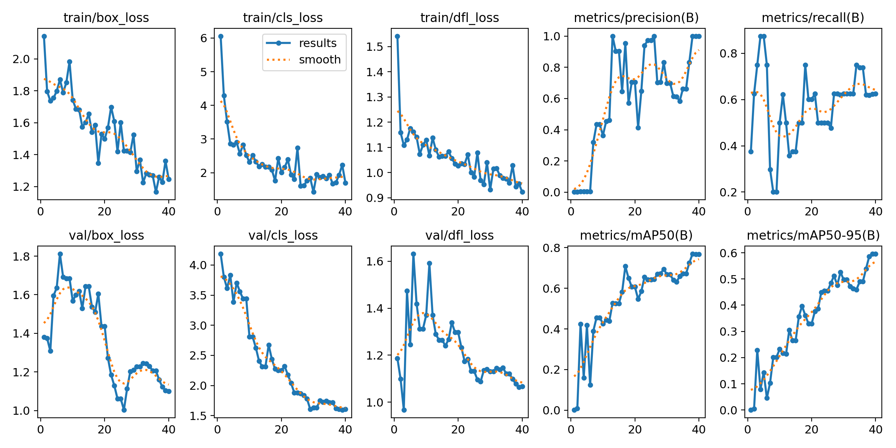
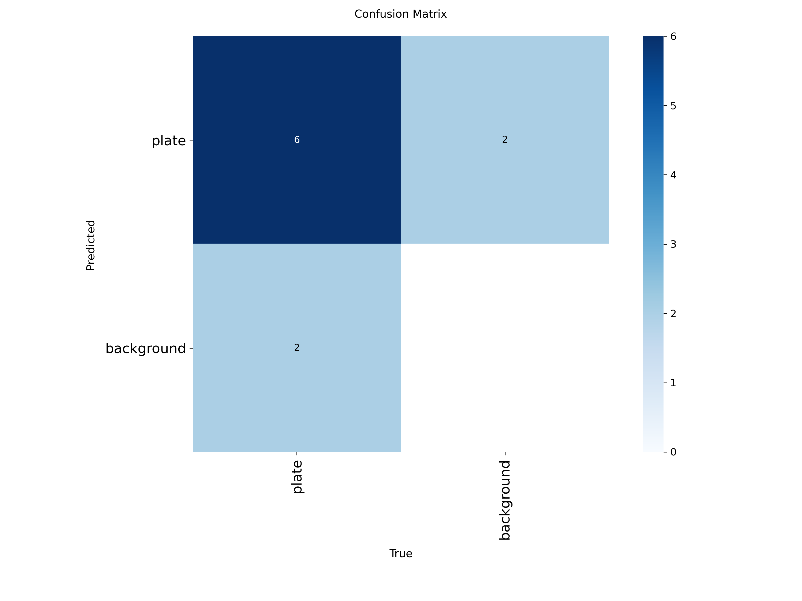
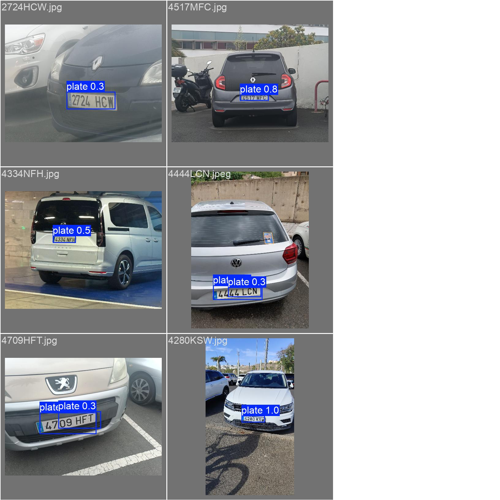
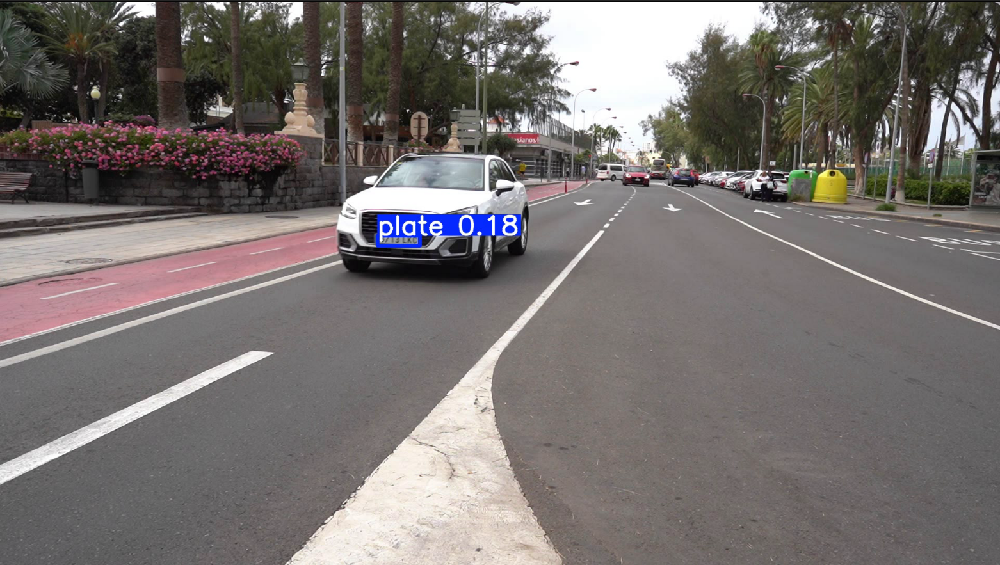
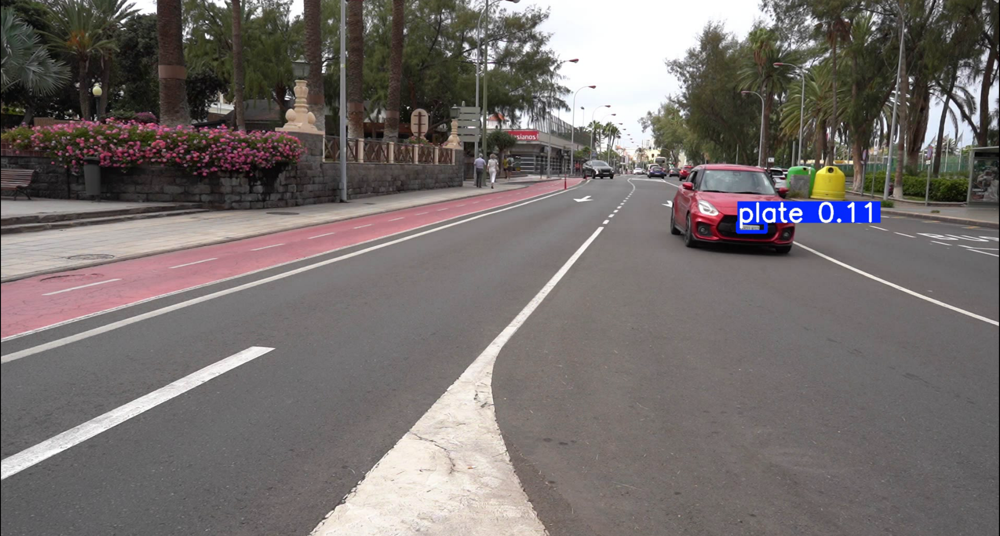

# Visión por Computador | Práctica 4

<p align="center">
  
</p>

## Requisitos para la ejecución del cuaderno

Para la ejecución del cuaderno se requiere la versión **3.9.5** de **Python**, junto con las siguientes librerías:

```text
ipykernel
easyocr
paddlepaddle==3.2.1
opencv-python
numpy
lap
```

El entorno utilizado para ejecutar los modelos fue un entorno Conda. Para la anotación de imágenes se empleó [*Labelme*](https://github.com/wkentaro/labelme), instalado en un entorno Conda con **Python 3.9.5** y la dependencia `labelme`.

## Desarrollo

### 1. Detector de personas y vehículos

El detector utiliza la versión *nano* de [YOLOv11](https://github.com/ultralytics/ultralytics) para procesar el vídeo de ejemplo y detectar, en cada fotograma, las instancias de las clases `person`, `bicycle`, `car` y `bus`.

Por cada detección se obtiene un identificador consistente con la clase del objeto, las coordenadas del rectángulo delimitador y la confianza de la predicción. Estos registros se almacenan en el fichero `C0142_tracks.csv` con la estructura: `fotograma, tipo_objeto, confianza, identificador_tracking, x1, y1, x2, y2`.

<p align="center">
  
</p>

Al final de la ejecución del detector se muestra el total de detecciones por clase. La salida registrada fue:

```text
bicycle: 49 detecciones, 3 tracks únicos
person: 3387 detecciones, 48 tracks únicos
car: 21841 detecciones, 250 tracks únicos
bus: 221 detecciones, 9 tracks únicos
```

En el vídeo anotado se observan limitaciones de detección a distancias elevadas y problemas de reidentificación: cuando un objeto queda parcialmente ocluido, el tracker asigna ocasionalmente un identificador distinto al reaparecer el objeto.

Para ejecutar el detector, se utilizó la configuración predeterminada del tracker definida en el fichero `botsort.yml`. Modificando los parámetros es posible obtener mejores resultados. La ejecución del cuaderno se realizó en una máquina virtual sin tarjeta gráfica, por lo que se decidió utilizar la versión *nano* de YOLOv11 para garantizar tiempos de ejecución razonables.

El enlace al vídeo generado con el seguimiento de los objetos detectados se encuentra subido a [OneDrive](https://alumnosulpgc-my.sharepoint.com/:v:/g/personal/oliver_cabrera101_alu_ulpgc_es/EcTwwtbjpaFJvuu_V0Tib9wBosIVJSyGLzupBbWRY_gyOg).

### 2. Detector de matrículas

Para la detección de matrículas se entrenó un modelo de YOLO utilizando el dataset de matrículas obtenido junto a los compañeros.

Las anotaciones del dataset se realizaron con [Labelme](https://github.com/wkentaro/labelme) y se convirtieron al formato YOLO mediante el script `labelme_jsons_to_yolo.py` con la estructura:

```text
<object-class-id> <x> <y> <width> <height>
```

El dataset se dividió manualmente en conjuntos de entrenamiento, validación y prueba, partiendo de 66 imágenes:

* 80% train = 53 imágenes
* 10% test = 7 imágenes
* 10% val = 6 imágenes

#### 2.1 Resultados del detector

<p align="center">
  
</p>

El entrenamiento se realizó con 40 épocas. Las curvas de validación muestran indicios de sobreajuste (p. ej., comportamiento de la gráfica `val/box_loss`), atribuible al reducido tamaño del conjunto de datos. El resto de gráficas se encuentra bajo [training-run](training-run).

<p align="center">
  
</p>

La matriz de confusión indica que el modelo presenta dificultades para identificar correctamente las matrículas en numerosas situaciones, cuando existe una matrícula visible, el modelo acierta aproximadamente en el 75% de los casos. También se observan falsas detecciones donde elementos del entorno se clasifican erróneamente como matrículas.

En imágenes de validación y en el vídeo de prueba se aprecia que el modelo detecta matrículas con confianza aceptable únicamente cuando la placa está próxima y nítida.

<p align="center">
  
</p>

En la imagen anterior se observan los errores del modelo y se sugiere que aplicando otra estrategia sería posible mejorar la detección de matrículas.

Al enfrentar el modelo entrenado al vídeo, se observa baja confianza en las matrículas, detectando únicamente aquellas situadas a distancias cercanas.

<p align="center">
  
</p>

<p align="center">
  
</p>

Para mejorar el entrenamiento se podría incrementar el tamaño del dataset. Aplicar *data augmentation* (variaciones de brillo, rotación, escala). Usar *early stopping* para mitigar el sobreajuste. Ajustar los parámetros del optimizador o la tasa de aprendizaje para mejorar la sensibilidad.

### 3. Comparativa de OCRs

Se realizó una comparativa entre los OCRs [**EasyOCR**](https://github.com/JaidedAI/EasyOCR) y [**PaddleOCR**](https://github.com/PaddlePaddle/PaddleOCR) utilizando 34 imágenes de matrículas del dataset. La precisión se calculó mediante la distancia de [Levenshtein](https://en.wikipedia.org/wiki/Levenshtein_distance) entre el número de matrícula correcto y el texto obtenido con cada OCR.

Los resultados fueron satisfactorios en general. **EasyOCR** obtuvo mejores resultados que **PaddleOCR**, incluso en los casos en que se produjeron errores, los números detectados eran más similares a los reales.

La tabla CSV generada se encuentra en [`plates_ocr_results.csv`](plates_ocr_results.csv).

Sin embargo, al intentar extraer las matrículas del vídeo de ejemplo, el proceso falló completamente. Los resultados del intento se encuentran en [`C0142_plates_detected.csv`](C0142_plates_detected.csv).

## Enlaces recursos generados

* [Dataset empleado para el entrenamiento del detector de matrículas.](https://alumnosulpgc-my.sharepoint.com/:u:/g/personal/oliver_cabrera101_alu_ulpgc_es/EXtOKkmad9pDiC7ojXVMROoBCEgqoFkAEU-Fdb452jFJvA?e=8saShJ)

* [Imágenes de matrículas para la comparación de OCRs.](https://alumnosulpgc-my.sharepoint.com/:u:/g/personal/oliver_cabrera101_alu_ulpgc_es/EVhDlh8kqAtJvoTWwkVs8D4BFf9P7BWc9qkWebbFDCec3Q?e=xUcbVW)

* [Vídeo detección personas y vehículos.](https://alumnosulpgc-my.sharepoint.com/:v:/g/personal/oliver_cabrera101_alu_ulpgc_es/EcTwwtbjpaFJvuu_V0Tib9wBosIVJSyGLzupBbWRY_gyOg)

## Uso de inteligencia artificial generativa

Se utilizó IA generativa para las siguientes tareas:

* Generación de fragmentos de ejemplo para utilizar YOLOv11.
* Ayuda con la generación del script [`labelme_jsons_to_yolo.py`](labelme_jsons_to_yolo.py).
* Explicación de funciones para escritura de archivos CSV y lectura de ficheros de un directorio en Python.
* Corrección y formalización del texto del README.

## Referencias

1. [Labelme](https://github.com/wkentaro/labelme) – Herramienta de anotación de imágenes.
2. [YOLOv11](https://github.com/ultralytics/ultralytics) – Implementación de YOLO para detección de objetos.
3. [EasyOCR](https://github.com/JaidedAI/EasyOCR) – Librería de OCR basada en deep learning.
4. [PaddleOCR](https://github.com/PaddlePaddle/PaddleOCR) – Librería de OCR basada en PaddlePaddle.
5. [Distancia de Levenshtein](https://en.wikipedia.org/wiki/Levenshtein_distance) – Métrica para calcular la diferencia entre cadenas de texto.


Autor: Oliver Cabrera Volo
